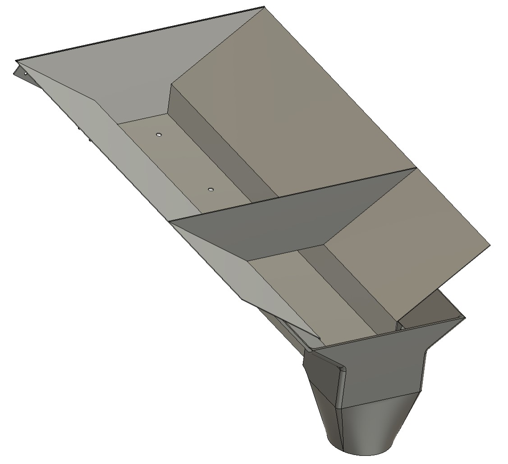
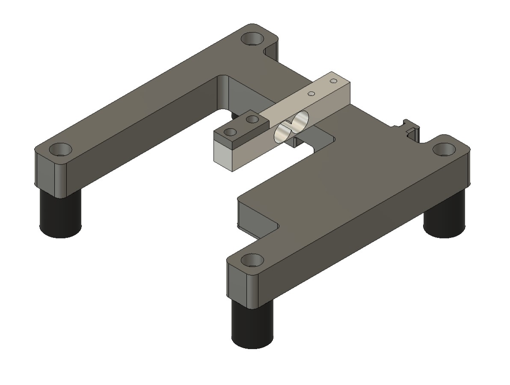

# Vibrodoser - Open Source Pulverfüllmaschine


## Einleitung 

Vibrodoser ist ein Open-Source-Projekt, das darauf abzielt, eine Maschine zum befüllen von Beuteln oder Behältern mit verschiedenen Schüttgütern wie Mehl, Pulver und ähnlichen Substanzen zu erstellen. Diese Dokumentation bietet eine umfassende Anleitung zu Hardware, Software und Montageanweisungen zum Bau deines eigenen des Vibrodosers an.

## Eigenschaften

- Der Vibrodoser füllt Mengen bis zu 1kg präzise und automatisch ab.
- Die Basis bildet ein Vibrationsförderer, um eine große Anzahl von Substanzen abzudecken.
- Die Steuerung verwendet einen Raspberry Pi und Node-RED zum Regeln und zur Überwachung.
- Eine einfache Wägezelle und HX711-Platine für genaues automatisiertes Wiegen.
- Alle Teile sind 3D-konstruiert um einen einfachen Nachbau und Modifikationen zu gewährleisten.

## Inhaltsverzeichnis

1. [Teile](#teile)
2. [Meschanisches Setup](#hardware-setup)
3. [Elektrisches Setup](#elektrisches-setup)
4. [Software Setup](#software-setup)
5. [Verwendung](#verwendung)
6. [Lizenz](#lizenz)

## Teile

Um deinen eigenen Vibrodoser zu bauen, benötigst du die folgenden Teile. Du kannst gerne auch andere Marken mit ähnlichen Spezifikationen verwenden:

### Liste der elektrischen Teile  

- Raspberry pi 3, 4, 5 (Preis ~50€)
- [Raspberry Pi 8-ch Relay Expansion Board](https://www.waveshare.com/rpi-relay-board-b.htm) (Preis ~25€)
- [1kg Wägezelle mit hx711 Platine](https://www.ebay.de/sch/i.html?_from=R40&_trksid=p2553889.m570.l1313&_nkw=hx+711+loadcell&_sacat=0) (Preis ~5€)
- [10A Power regulator from kemo](https://www.kemo-electronic.de/en/Transformer-Dimmer/M240-Power-Control-230-V-AC-10-A-Multifunction.php) (Preis ~50€)
- [Vibrationsförderer von Afag](https://www.afag.com/en/products/detail/linear-feeder-hlf-m-3.html) (get a used one from ebay ~350€)
- [5v ~5a DIN rail Netzteil HDR-60-5](https://www.meanwell-web.com/en-gb/ac-dc-ultra-slim-din-rail-power-supply-input-range-hdr--60--5) (Preis ~20€)  
- [13a Sicherung 1p+N, C-13A](https://www.hager.at/produktkatalog/energieverteilung-und-schutz-schaltgeraete/reiheneinbaugeraete/leitungsschutzschalter/ls-schalter-6ka/mcn513/19391.htm) (Preis 15€)
- 600mm x 400mm x 200mm control cabinet (Preis ~80€)
- Sachen wie Kabel, DIN-Schienen, Kabelkanäle etc.  (Preis ~50€)

Optional zur Visualisierung (Man kann auch das Smartphone oder den Laptop verwenden)

- Ein günstiges 10" Tablet
- Eine Tablet-Halterung, die zu Ihrem Tablet passt, damit das Tablet am Vibrodoser befestigt werden kann

### Liste der 3D Modelle und mechanischen Teile  

- 10m 40mmx40mm Stahlrohre (Preis ~200€)
- 5mm Stahlplatte (Preis ~200€)
  - 2x 600mmx 800mm
  - 1x 280mm x 600mm  

- 1x [Schlachttrichter Ø500mm größe 4](https://www.ebay.de/itm/145450569265?hash=item21dd878e31:g:K0YAAOSwKIpWEknz&amdata=enc%3AAQAIAAAA8IJstNXBvNsnDHynN1ARbeMmIM2RTDK0K0byh1Schn6cR55PfUV6%2FWkCOXgoQsoSMWsgQ46JCbTPhQQiFRqzUXaENnnVDTDB4YlJRSwsX2fy4cljnJNS2BWMqjffDGSFSRTXIC3v12NKAL6RtGeW3B3bXNU%2FtaW5GWBdDq65cdCbEL7cf7cpnC5TymgzmiPvzanPqKL3Xmk%2F1EjCQzifAWpVU6Qh51CCzLHAt4d8c%2BFCl1nhBx%2BNgaY3dKSdFdonyoupke8HrSbCEVxiSJ1mWzITPoJQdQEEFhZjgVUPE4u7JdISO1WimzrfNwvIGq4b3g%3D%3D%7Ctkp%3ABk9SR77R3-iYYw) (Preis ~200€)
- 3x Trichter Halter (3d print)
- 8x [silent blocks M6 Ø 20 / H 25mm](https://www.ebay.de/sch/i.html?_from=R40&_trksid=p2334524.m570.l1313&_nkw=silent+blocks+m6+h+15&_sacat=0&LH_TitleDesc=0&_odkw=silent+blocks+m6+h+15&_osacat=0) (Preis ~20€)
- 4x [Maschinenfüße m8](https://www.ebay.de/sch/i.html?_from=R40&_trksid=p2332490.m570.l1313&_nkw=machine+feet&_sacat=0)

Optional für die Staubabsaugung:

- Abschaugtrichter (3d print)
- Ø50mm KG-Rohr 1000mm  
- Ø50mm KG-Rohr 200mm  
- 2x 90° Winkel Ø50mm KG-Rohr
- 2x Ø50mm Rohrklemme
- Staubsauger

Optional für die Wlan/Lan-Verbindung des Raspberry Pi's (Es muss kein separates Netzwerk erstellt werden, man kann auch das eigene Netzwerk verwenden):

- Einen billigen Wlan-Router (meist haben sie eine Eingangsspannung von 12 Volt, wähle ein Netzteil, das zum Router passt)  
- [12v ~5a DIN rail Netzteil HDR-60-12](https://www.meanwell-web.com/en-gb/ac-dc-ultra-slim-din-rail-power-supply-input-range-hdr--60--12) (Preis ~20€)

## Hardware-Setup


### Rahmen

[...]

### Trichter / Behälter

[...]

### Förderrinne



[...]

### Waage montieren



[...]

## Elektrisches Setup

[...]

### Verkabelungsdiagramme und Schaltpläne des Steuerschranks

folgen bald

## Software-Setup

[...]

### Raspberry Pi-Konfiguration

[...]

#### Schritte zur Einrichtung des Raspberry Pi

[...]

#### Installation von Node-RED und den notwendigen Paketen

[official tutorial](https://nodered.org/docs/getting-started/raspberrypi)  

```console
sudo apt-get update && sudo apt-get upgrade && \
bash <(curl -sL https://raw.githubusercontent.com/node-red/linux-installers/master/deb/update-nodejs-and-nodered) && \
sudo systemctl enable nodered.service && \
sudo reboot
```

http://<hostname>:1880. Sie können die IP-Adresse finden, indem Sie auf dem Pi den Befehl hostname -I ausführen.

Installieren Sie nun die folgenden Pakete für das Node-RED-Dashboard und den MQTT-Broker."

-[node-red-contrib-aedes](https://flows.nodered.org/node/node-red-contrib-aedes)  
-[node-red-dashboard](https://flows.nodered.org/node/node-red-dashboard)  

Jetzt importiere den [flow](./flow/flow.json) zu nodered. Siehe dazu diese Anleitung [Importing and Exporting Flows](https://nodered.org/docs/user-guide/editor/workspace/import-export)

#### Node-RED Flow

"Der Flow stellt einen MQTT-Broker zur Kommunikation mit dem Waagenservice bereit. Der Flow lauscht auf vibroDoser/scale/load und sendet das Tara-Kommando an vibroDoser/scale/tare an die Waage. Während dieser Aktivität werden alle Messungen von der Waage blockiert."

## Verwendung

Schalten Sie den Vibrodoser ein. Warten Sie, bis das Node-RED-Dashboard (http://<hostname>:1880/ui) erreichbar ist. Der erste Schritt ist das Tarieren der Waage. Platzieren Sie Ihren Beutel oder Behälter auf der Waage und drücken Sie die "Tarieren"-Taste. Stellen Sie nun das Zielgewicht ein (100 g - 1000 g). Jetzt können Sie automatisch den Beutel befüllen. Der Zuführer verlangsamt sich, wenn das Gewicht 80% des Zielgewichts erreicht. Nachdem das Befüllen abgeschlossen ist, entfernen Sie den Beutel und überprüfen Sie das Gewicht mit einer kalibrierten Waage. Wenn Sie mit dem Ergebnis zufrieden sind, können Sie weitere Beutel befüllen. Andernfalls verringern Sie das Zielgewicht oder die Geschwindigkeit des Zuführers (10% - 100%). Manchmal müssen Sie mit den Einstellungen spielen, bis Sie ein zufriedenstellendes Ergebnis erzielen. Die Konsistenz des Pulvers, die Luftfeuchtigkeit und die Temperatur beeinflussen die Fließfähigkeit des Pulvers erheblich.

Abschließend einige Sicherheitshinweise: Wenn Sie mit Pulver arbeiten, achten Sie auf Staub. Staub kann zu Staubexplosionen führen. Verwenden Sie einen guten Staubsauger, um zu viel Staub zu vermeiden.

Genießen Sie Ihren Vibrodoser und steigern Sie die Produktivität Ihres Unternehmens.

## Lizenz  

Vibrodoser is licensed under the GNU GENERAL PUBLIC LICENSE. Please refer to the [LICENSE](LICENSE) file for more details.

If you distribute copies of such a program, whether gratis or for a fee, you must pass on to the recipients the same freedoms that you received. You must make sure that they, too, receive or can get the source code. And you must show them these terms so they know their rights as Outlined in the GPLv3 License.

THIS SOFTWARE IS PROVIDED BY THE COPYRIGHT HOLDERS AND CONTRIBUTORS "AS IS" AND ANY EXPRESS OR IMPLIED WARRANTIES, INCLUDING, BUT NOT LIMITED TO, THE IMPLIED WARRANTIES OF MERCHANTABILITY AND FITNESS FOR A PARTICULAR PURPOSE ARE DISCLAIMED. IN NO EVENT SHALL BE LIABLE FOR ANY DIRECT, INDIRECT, INCIDENTAL, SPECIAL, EXEMPLARY, OR CONSEQUENTIAL DAMAGES (INCLUDING, BUT NOT LIMITED TO, PROCUREMENT OF SUBSTITUTE GOODS OR SERVICES; LOSS OF USE, DATA, OR PROFITS; OR BUSINESS INTERRUPTION) HOWEVER CAUSED AND ON ANY THEORY OF LIABILITY, WHETHER IN CONTRACT, STRICT LIABILITY, OR TORT (INCLUDING NEGLIGENCE OR OTHERWISE) ARISING IN ANY WAY OUT OF THE USE OF THIS SOFTWARE, EVEN IF ADVISED OF THE POSSIBILITY OF SUCH DAMAGE.  
