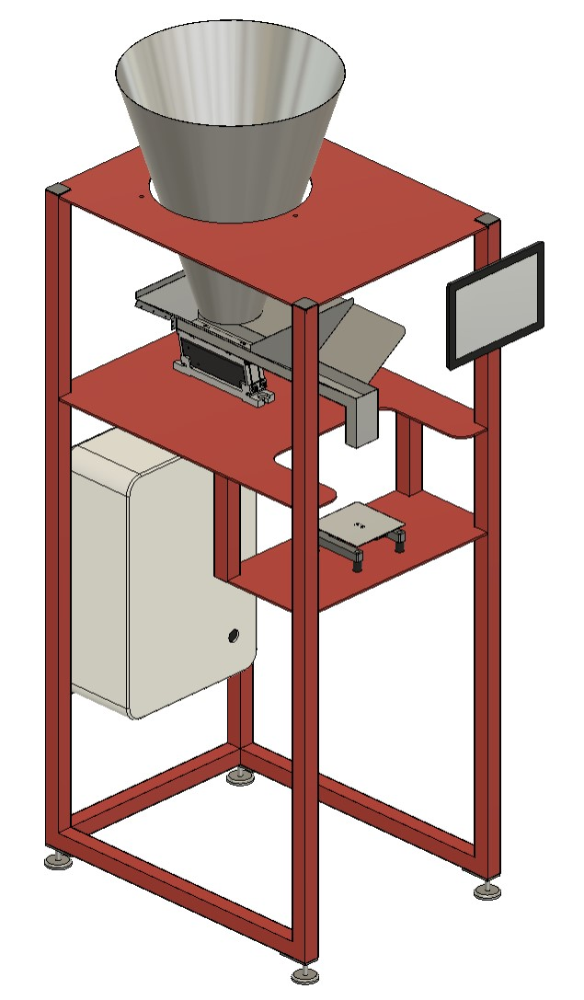

# Vibrodoser - Open Source Bulk Filling Machine  



## Introduction  

Vibrodoser is an open-source project aimed at creating a machine for accurately filling bags with various bulk materials such as flour, powder, and other similar substances. This documentation provides a comprehensive guide on the hardware, software, and assembly instructions for replicating the Vibrodoser.

## Features

- Vibrodoser fills 1kg bags and containers with precision.  
- Utilizes a Raspberry Pi and Node-RED for control and monitoring.
- Incorporates an HX711 board and load cell for accurate weighing.
- 3D modeled for easy replication and modifications.

## Table of Contents

1. [Hardware Requirements](#hardware-requirements)
2. [Software Setup](#software-setup)
3. [Assembly Instructions](#assembly-instructions)
4. [Usage Guide](#usage-guide)
5. [License](#license)

## Hardware Requirements

To build your own Vibrodoser you will need the following parts. Feel free to use other brands with similar specifications:

### List of electrical parts (price ~700€)

- Raspberry pi 3, 4, 5 (price ~50€)
- Raspberry Pi 8-ch Relay Expansion Board [waveshare](https://www.waveshare.com/rpi-relay-board-b.htm) (price ~25€)
- 1kg load cell with hx711 A/D [hx711](https://www.ebay.de/sch/i.html?_from=R40&_trksid=p2553889.m570.l1313&_nkw=hx+711+loadcell&_sacat=0) (price ~5€)
- 10A Power regulator [kemo](https://www.kemo-electronic.de/en/Transformer-Dimmer/M240-Power-Control-230-V-AC-10-A-Multifunction.php) (price ~50€)
- Linear feeder [Afag](https://www.afag.com/en/products/detail/linear-feeder-hlf-m-3.html) (get a used one from ebay ~350€)
- 5v ~5a DIN rail power supply [HDR-60-5](https://www.meanwell-web.com/en-gb/ac-dc-ultra-slim-din-rail-power-supply-input-range-hdr--60--5) (price ~20€)  
- 12v ~5a DIN rail power supply [HDR-60-12](https://www.meanwell-web.com/en-gb/ac-dc-ultra-slim-din-rail-power-supply-input-range-hdr--60--12) (price ~20€)  
- 13a fuse 1p+N, C-13A [Hager](https://www.hager.at/produktkatalog/energieverteilung-und-schutz-schaltgeraete/reiheneinbaugeraete/leitungsschutzschalter/ls-schalter-6ka/mcn513/19391.htm) (price 15€)
- 600mm x 400mm x 200mm control cabinet (price ~80€)
- stuff like cabels, DIN-Rail, wire ducts etc. (price ~50€)

### List of 3D models and mechanical parts (price ~500€)  

- 10m 40mmx40mm steel pipes (price ~200€)
- 5mm steel plate (price ~200€)  
    * 2x 600mmx 800mm
    * 1x 280mm x 600mm  
- big slaughter funnel Ø500mm [size 4](https://www.ebay.de/itm/145450569265?hash=item21dd878e31:g:K0YAAOSwKIpWEknz&amdata=enc%3AAQAIAAAA8IJstNXBvNsnDHynN1ARbeMmIM2RTDK0K0byh1Schn6cR55PfUV6%2FWkCOXgoQsoSMWsgQ46JCbTPhQQiFRqzUXaENnnVDTDB4YlJRSwsX2fy4cljnJNS2BWMqjffDGSFSRTXIC3v12NKAL6RtGeW3B3bXNU%2FtaW5GWBdDq65cdCbEL7cf7cpnC5TymgzmiPvzanPqKL3Xmk%2F1EjCQzifAWpVU6Qh51CCzLHAt4d8c%2BFCl1nhBx%2BNgaY3dKSdFdonyoupke8HrSbCEVxiSJ1mWzITPoJQdQEEFhZjgVUPE4u7JdISO1WimzrfNwvIGq4b3g%3D%3D%7Ctkp%3ABk9SR77R3-iYYw) (price ~200€)

optional for dust collection:

- Ø50mm pipe 1000mm  
- Ø50mm pipe 200mm  
- 2x 90° elbow for Ø50mm pipe
- 2x Ø50mm pipe clamp
- cheap vacuum cleaner

### Wiring diagrams and schematics

## Software Setup

### Raspberry Pi Configuration

#### Steps to set up Raspberry Pi

1. Copy [hx7111](hx711/hx711.py) and [vibrodoser.py](./hx711/vibroDoser.py) to the pi /home/pi/vibrodoser/
2. Make vibrodoser.py executable ```chmod +x /home/pi/vibroDoser/vibroDoser.py```  
3. Add the content of the [Service](./service/vibrodoser.service) file to /etc/systemd/system/vibrodoser.service
4. Enable the service  with ```sudo systemctl enable vibroDoser.service```

#### Installation of Node-RED and necessary packages

[official tutorial](https://nodered.org/docs/getting-started/raspberrypi)  

```console
sudo apt-get update && sudo apt-get upgrade && \
bash <(curl -sL https://raw.githubusercontent.com/node-red/linux-installers/master/deb/update-nodejs-and-nodered) && \
sudo systemctl enable nodered.service && \
sudo reboot
```

When browsing from another machine you should use the hostname or IP-address of the Pi: http://<hostname>:1880. You can find the IP address by running hostname -I on the Pi.  

Now install the following pallets for nodered dashboard and mqtt broker

-[node-red-contrib-aedes](https://flows.nodered.org/node/node-red-contrib-aedes)  
-[node-red-dashboard](https://flows.nodered.org/node/node-red-dashboard)  

Now import the [flow](./flow/flow.json) to nodered.

### Node-RED Flow

1. Description of Node-RED flow for controlling the machine
2. Instructions on importing the flow

## Assembly Instructions

### Step-by-step assembly guide

1. get and print the parts
2. weld and paint the frame
3.  
4. Images or diagrams illustrating the assembly process

## Usage Guide

1. How to operate the Vibrodoser
2. Troubleshooting common issues
3. Safety precautions
4.  

## License  

Vibrodoser is licensed under the GNU GENERAL PUBLIC LICENSE. Please refer to the [LICENSE](LICENSE) file for more details.

If you distribute copies of such a program, whether gratis or for a fee, you must pass on to the recipients the same freedoms that you received. You must make sure that they, too, receive or can get the source code. And you must show them these terms so they know their rights as Outlined in the GPLv3 License.

THIS SOFTWARE IS PROVIDED BY THE COPYRIGHT HOLDERS AND CONTRIBUTORS "AS IS" AND ANY EXPRESS OR IMPLIED WARRANTIES, INCLUDING, BUT NOT LIMITED TO, THE IMPLIED WARRANTIES OF MERCHANTABILITY AND FITNESS FOR A PARTICULAR PURPOSE ARE DISCLAIMED. IN NO EVENT SHALL BE LIABLE FOR ANY DIRECT, INDIRECT, INCIDENTAL, SPECIAL, EXEMPLARY, OR CONSEQUENTIAL DAMAGES (INCLUDING, BUT NOT LIMITED TO, PROCUREMENT OF SUBSTITUTE GOODS OR SERVICES; LOSS OF USE, DATA, OR PROFITS; OR BUSINESS INTERRUPTION) HOWEVER CAUSED AND ON ANY THEORY OF LIABILITY, WHETHER IN CONTRACT, STRICT LIABILITY, OR TORT (INCLUDING NEGLIGENCE OR OTHERWISE) ARISING IN ANY WAY OUT OF THE USE OF THIS SOFTWARE, EVEN IF ADVISED OF THE POSSIBILITY OF SUCH DAMAGE.  
