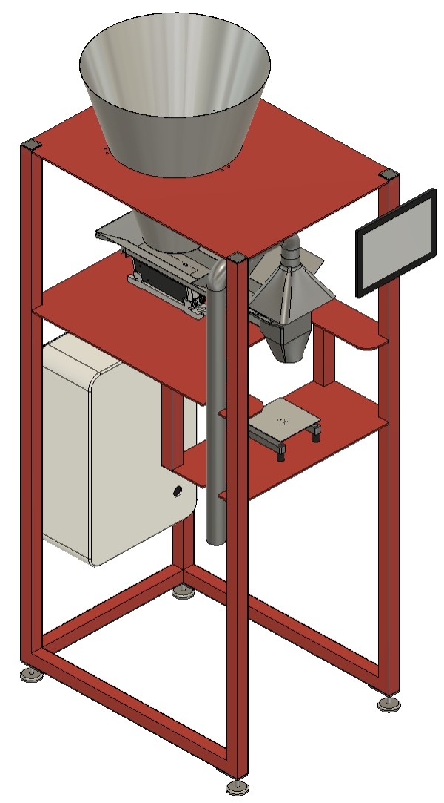

# Vibrodoser - Open Source Powder Filling Machine  



## Introduction  

Vibrodoser is an open-source project aimed at creating a machine for accurately filling bags with various bulk materials such as flour, powder, and other similar substances. This documentation provides a comprehensive guide on the hardware, software, and assembly instructions for replicating the Vibrodoser.

## Features

- Vibrodoser fills up to 1kg bags and containers with precision  
- A linear feeder for a large number of substances  
- Utilizes a Raspberry Pi and Node-RED for control and monitoring
- Incorporates an HX711 board and load cell for accurate weighing
- 3D modeled for easy replication and modifications

## Table of Contents

1. [Parts](#parts)
2. [Hardware Setup](#hardware-setup)
3. [Electrical Setup](#electrical-setup)
4. [Software Setup](#software-setup)
5. [Assembly Instructions](#assembly-instructions)
6. [Usage Guide](#usage-guide)
7. [License](#license)

## Parts

To build your own Vibrodoser you will need the following parts. Feel free to use other brands with similar specifications:

### List of electrical parts (price ~700€)

- Raspberry pi 3, 4, 5 (price ~50€)
- [Raspberry Pi 8-ch Relay Expansion Board from waveshare](https://www.waveshare.com/rpi-relay-board-b.htm) (price ~25€)
- [1kg load cell with a hx711 A/D hx711](https://www.ebay.de/sch/i.html?_from=R40&_trksid=p2553889.m570.l1313&_nkw=hx+711+loadcell&_sacat=0) (price ~5€)
- [10A Power regulator from kemo](https://www.kemo-electronic.de/en/Transformer-Dimmer/M240-Power-Control-230-V-AC-10-A-Multifunction.php) (price ~50€)
- [Linear feeder from Afag](https://www.afag.com/en/products/detail/linear-feeder-hlf-m-3.html) (get a used one from ebay ~350€)
- [5v ~5a DIN rail power supply HDR-60-5](https://www.meanwell-web.com/en-gb/ac-dc-ultra-slim-din-rail-power-supply-input-range-hdr--60--5) (price ~20€)  
- [12v ~5a DIN rail power supply HDR-60-12](https://www.meanwell-web.com/en-gb/ac-dc-ultra-slim-din-rail-power-supply-input-range-hdr--60--12) (price ~20€)  
- [13a fuse 1p+N, C-13A](https://www.hager.at/produktkatalog/energieverteilung-und-schutz-schaltgeraete/reiheneinbaugeraete/leitungsschutzschalter/ls-schalter-6ka/mcn513/19391.htm) (price 15€)
- 600mm x 400mm x 200mm control cabinet (price ~80€)
- stuff like cabels, DIN-Rail, wire ducts etc. (price ~50€)

optional for visualisation (you can use your smartphone or laptop too)

- a cheap 10" tablet
- a tablet holder that fits your tablet, so you can mount the tablet to the vibrodoser

### List of 3D models and mechanical parts (price ~500€)  

- 10m 40mmx40mm steel pipes (price ~200€)
- 5mm steel plate (price ~200€)  
    * 2x 600mmx 800mm
    * 1x 280mm x 600mm  
- 1x [big slaughter funnel Ø500mm size 4](https://www.ebay.de/itm/145450569265?hash=item21dd878e31:g:K0YAAOSwKIpWEknz&amdata=enc%3AAQAIAAAA8IJstNXBvNsnDHynN1ARbeMmIM2RTDK0K0byh1Schn6cR55PfUV6%2FWkCOXgoQsoSMWsgQ46JCbTPhQQiFRqzUXaENnnVDTDB4YlJRSwsX2fy4cljnJNS2BWMqjffDGSFSRTXIC3v12NKAL6RtGeW3B3bXNU%2FtaW5GWBdDq65cdCbEL7cf7cpnC5TymgzmiPvzanPqKL3Xmk%2F1EjCQzifAWpVU6Qh51CCzLHAt4d8c%2BFCl1nhBx%2BNgaY3dKSdFdonyoupke8HrSbCEVxiSJ1mWzITPoJQdQEEFhZjgVUPE4u7JdISO1WimzrfNwvIGq4b3g%3D%3D%7Ctkp%3ABk9SR77R3-iYYw) (price ~200€)
- 3x funnel holder (3d print)
- 8x [silent blocks M6 Ø 20 / H 25mm](https://www.ebay.de/sch/i.html?_from=R40&_trksid=p2334524.m570.l1313&_nkw=silent+blocks+m6+h+15&_sacat=0&LH_TitleDesc=0&_odkw=silent+blocks+m6+h+15&_osacat=0) (price ~20€)
- 4x [machine feet](https://www.ebay.de/sch/i.html?_from=R40&_trksid=p2332490.m570.l1313&_nkw=machine+feet&_sacat=0)

optional for dust collection:

- suction funnel (3d print)
- Ø50mm pipe 1000mm  
- Ø50mm pipe 200mm  
- 2x 90° elbow for Ø50mm pipe
- 2x Ø50mm pipe clamp
- vacuum cleaner

## Hardware-Setup

### Frame

To build the frame of the vibrodoser you need to cut the 40mmx40mm pipes into the following dimensions:

- 4x 1600mm
- 2x 720mm
- 2x 255mm
- 1x 520mm

Weld the pipes and plates together, as you can see in the sketch or 3d model. Make sure everything is perfectly aligned and straight. The cutouts from the plates fits the pipes and should help with the alignment. Weld the footplate to the frame so you can attach the machine feet to the frame. To protect the frame and give your vibrodoser a unique look, you should paint the frame in your favorite color.  

### Funnel / Reservoir

Print the [funnel holder](./cad/3dPrint/Frame/FunnelHolder.3mf) three times. Attach the funnel holders to the frame. Place and align the funnel to the frame. Mark and drill three holes to mount the funnel to the frames (M6x20).

### feeder gutter

To build the gutter use a 1mm stainless steel plate. Cut and bend the parts into dimensions.  

- [gutter]()
- [gutter]()

You can weld the stainless steel plates together or just use screws. If you want to use screws, drill holes to the gutter. Make sure you use screw glue or self-locking nuts. The "smoother gate" in the front is optional. It will help to achieve a smooth level of powder.  

- [smoother gate]()

### Assembly the scale

To assamble the scale you will need to print three parts:

- [ScaleBase](./cad/3dPrint/Scale/ScaleBase.3mf)
- [hx711Cover](./cad/3dPrint/Scale/hx711Cover.3mf)
- [ScaleDistance](./cad/3dPrint/Scale/ScaleDistance.3mf)

optional you can print the scale plate too, but its recommended to use a stainless steel plate:

- [ScalePlate](./cad/3dPrint/Scale/ScalePlate.3mf) or [ScalePlate](./cad/dxf/ScalePlate.3mf)

First screw the load cell onto the base (2x M5x25). Screw the hx711 board onto the hx711 cover (2x M3x8 and nuts). Shorten the cables of the load cell and solder them with the hx711 board  

- Normally: red wire to +E, black wire to -E, green wire to +S, white wire to -S

Make sure this connection fits the manufacturer's specifications of your load cell. Solder a cable with 4 strands to the hx711 board and make sure the cable is long enough to reach the raspberry pi.  

- Vcc to 5v, Gnd to Gnd, DT to Pin 22 (Gpio 25) and SCK to Pin 23 (Gpio 11).  

Screw the hx711 cover to the base (4x M3x20). Finally screw the scale plate to the load cell with the scale distance between (2x M4x19). If no data arrives in nodered, check the cabling.

The scale fits to the scale frame plate. Screw the dumpers between the plate and the scale to protect the scale from vibrations.

## Electrical-Setup

WARNING electrical installation are dangerous. If you not know what to do, ask a professional to do the job for you !

### Wiring diagrams and schematics of the control cabinet


## Software Setup

### Raspberry Pi Configuration

Try to avoid using an simple sd card, try to use a good quality usb stick. There's a lot of tutorials to boot the pi 3 from a usb stick. The pi 4 and up, support usb boot out of the box. Flash the latest raspberry pi os to the stick and power up the pi.  

#### Steps to set up Raspberry Pi

1. Create a directory with ```mkdir /home/pi/vibrodoser```  
2. Copy [hx7111](hx711/hx711.py) and [vibrodoser.py](./hx711/vibroDoser.py) to the pi /home/pi/vibrodoser/
3. Make vibrodoser.py executable ```chmod +x /home/pi/vibroDoser/vibroDoser.py```  
4. Add the content of the [vibrodoser.service](./service/vibrodoser.service) file to /etc/systemd/system/vibrodoser.service
5. Enable the service with ```sudo systemctl enable vibroDoser.service```
6. Start the service with ```sudo systemctl start vibroDoser.service```
7. Check the service with ```sudo systemctl status vibroDoser.service```

The service execute the vibroDoser.py script on boot and take care of a reboot is necessary.

#### Installation of Node-RED and necessary packages

[official tutorial](https://nodered.org/docs/getting-started/raspberrypi)  

```console
sudo apt-get update && sudo apt-get upgrade && \
bash <(curl -sL https://raw.githubusercontent.com/node-red/linux-installers/master/deb/update-nodejs-and-nodered) && \
sudo systemctl enable nodered.service && \
sudo reboot
```

When browsing from another machine you should use the hostname or IP-address of the Pi: http://<hostname>:1880. You can find the IP address by running hostname -I on the Pi.  

Now install the following pallets for nodered dashboard and mqtt broker

-[node-red-contrib-aedes](https://flows.nodered.org/node/node-red-contrib-aedes)  
-[node-red-dashboard](https://flows.nodered.org/node/node-red-dashboard)  

Now import the [flow](./flow/flow.json) to nodered. See this instructions [Importing and Exporting Flows](https://nodered.org/docs/user-guide/editor/workspace/import-export)

#### Node-RED Flow

1. Description of Node-RED flow for controlling the machine

## Usage Guide

Power on the Vibrodoser. Wait until the nodered dashboard (http://<hostname>:1880/ui) is reachable. The first thing is to tare the scale. Place your bag or container on the scale and hit the "tare" button. Now set the target weight (100g-1000g). You are now good to fill the bag automatically. The feeder slows down, when the weight hits 80% of the target weight. After the filling is complete, remove the bag and check the weight with a calibrated scale. If you are happy with the result, you can fill more bags, if not decrease the target weight or the speed of the feeder (10%-100%). Sometimes you have to play with the settings, until you find a satisfactory result. The consistency of the powder, humidity and temperature have a major influence on the flowability of the powder.  

Finally, some safety information. If your work with powder, watch out for dust. Dust can lead to dust explosions. Use a good vacuum cleaner to avoid too much dust.

Enjoy your vibrodoser und increase the productivity of your company

## License  

Vibrodoser is licensed under the GNU GENERAL PUBLIC LICENSE. Please refer to the [LICENSE](LICENSE) file for more details.

If you distribute copies of such a program, whether gratis or for a fee, you must pass on to the recipients the same freedoms that you received. You must make sure that they, too, receive or can get the source code. And you must show them these terms so they know their rights as Outlined in the GPLv3 License.

THIS SOFTWARE IS PROVIDED BY THE COPYRIGHT HOLDERS AND CONTRIBUTORS "AS IS" AND ANY EXPRESS OR IMPLIED WARRANTIES, INCLUDING, BUT NOT LIMITED TO, THE IMPLIED WARRANTIES OF MERCHANTABILITY AND FITNESS FOR A PARTICULAR PURPOSE ARE DISCLAIMED. IN NO EVENT SHALL BE LIABLE FOR ANY DIRECT, INDIRECT, INCIDENTAL, SPECIAL, EXEMPLARY, OR CONSEQUENTIAL DAMAGES (INCLUDING, BUT NOT LIMITED TO, PROCUREMENT OF SUBSTITUTE GOODS OR SERVICES; LOSS OF USE, DATA, OR PROFITS; OR BUSINESS INTERRUPTION) HOWEVER CAUSED AND ON ANY THEORY OF LIABILITY, WHETHER IN CONTRACT, STRICT LIABILITY, OR TORT (INCLUDING NEGLIGENCE OR OTHERWISE) ARISING IN ANY WAY OUT OF THE USE OF THIS SOFTWARE, EVEN IF ADVISED OF THE POSSIBILITY OF SUCH DAMAGE.  
